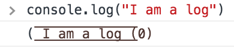

console.log inserts environmental consciousness and puns into logging for web development. It's inspired by an excellent, Leptodactylidaeic approach to logging pioneered by <a target="_blank" href="http://tholman.com/console-dot-frog/">Tim Holman</a>. 

With console.log, you can now log messages to a browser console that look more like logs than they did before:

For more features and bad jokes, check out console.log on <a target="_blank" href="https://github.com/Duncan93/console.log">GitHub</a>.
